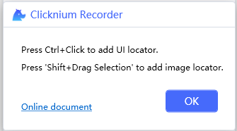

# Image Automation<!-- {docsify-ignore-all} -->

  - [Overview](#overview)
  - [Record image locator](#record-image-locator)
  - [Use image locator in project](#use-image-locator-in-project)
  - [Example](#example)

## Overview
Clicknium automation stask with many functions supports image automation.
Clicknium locator schema is designed for extension in windows application locator, java application locator and image locator.

## Record image locator
Open project in Visual Studio Code by pressing `Ctrl` + F10, or clicking the button `record` to invoke clicknium recorder.  
  

When you move the mouse, it will highlight the element. If you want to record the element, press `Ctrl` and click it. If you want to record the image, you can press `Shift` and select one area with the mouse, which will be stored as image in locator.  
   

For example  
- choose the target element  

  
- press `Shift` and drag to select an area  

  

You will get the locator as follows: 
  

Image locator contians two parts.  
The first part is anchor element. during running, will first try to find the anchor element, and then capture anchor image depens on the image method attrbiute, try find the target image in anchor image through image matching, we use opencv library to do image matching. 
Second part is image, supporting the following attrbiutes:  

| Name      | Description | equals | contains |startWith |endWith |
| ----------- | ----------- |----------- |----------- |----------- |----------- |
| accuracy | The minimum similarity between the target image to be found and the one in image locator. It is useful when the image to be found is slightly different than the one in locator. Measurement unit is from 0 to 1 with default value 0.75. |<font color=Green><B>Yes</B></font>   |<font color=Red><B>No</B></font>|<font color=Red><B>No</B></font>|<font color=Red><B>No</B></font>|
| dpi |  the DPI settings of windows OS during recording, we recommend the DPI settings of windows OS during running is same as the seetins during recording|<font color=Green><B>Yes</B></font>   |<font color=Red><B>No</B></font>|<font color=Red><B>No</B></font>|<font color=Red><B>No</B></font>|
| method | enum values, define the algorithm about image matching.  the value is autoset during recording |  |<font color=Green><B>Yes</B></font>   |<font color=Red><B>No</B></font>|<font color=Red><B>No</B></font>|<font color=Red><B>No</B></font>|
| filepaPath | the selection area image during recording, will be used during running for image matching |<font color=Green><B>Yes</B></font>   |<font color=Red><B>No</B></font>|<font color=Red><B>No</B></font>|<font color=Red><B>No</B></font>|
| matchIndex | if find more during image matching, which one will be selected, default value is 0, means the first matching area |<font color=Green><B>Yes</B></font>   |<font color=Red><B>No</B></font>|<font color=Red><B>No</B></font>|<font color=Red><B>No</B></font>|
| elementRect | store the anchor element area during recording. Don't need modify the value |<font color=Green><B>Yes</B></font>   |<font color=Red><B>No</B></font>|<font color=Red><B>No</B></font>|<font color=Red><B>No</B></font>|
| selectionRect | store the selection area during recording. Don't need modify the value |<font color=Green><B>Yes</B></font>   |<font color=Red><B>No</B></font>|<font color=Red><B>No</B></font>|<font color=Red><B>No</B></font>|
| timeout |Specifies the maximum time interval to do image matching, default value is 5000 milliseconds  |<font color=Green><B>Yes</B></font>   |<font color=Red><B>No</B></font>|<font color=Red><B>No</B></font>|<font color=Red><B>No</B></font>|

the definition of method:
- HighestAccuracy: compare the images found in whole windows screen
- InRegionHighestAccuracy: compare the images found in anchor element area
- OutRegionHighestAccuracy: comapre the images found out of the anchor element area

`method` attrbiute is auto set during recording based on the selection area corresponding to the anchor area,  
if the selection area is inside the anchor element area, will be set to 'InRegionHighestAccuracy';  
if the selection area is intersect with the anchor element area, will be set to 'HighestAccuracy';
if the selection area is outside the anchor element area, will be set to 'OutRegionHighestAccuracy';

## Use image locator in project
Image locator can be used in the same way as other locators, for example  
```
from clicknium import clicknium as cc, locator, ui


#open new browser window
driver = cc.chrome.open("https://www.bing.com")
driver.find_element(locator.chrome.img1).click

ui(locator.notepad.menuitem).click()
```  

The following functions support image locator:
- click
- double_click
- drag_drop
- get_position
- get_size
- highlight
- hover
- send_hotkey
- set_text: input_method should be `keyboardsimulatewithclick`

## Example
If the application or the target UI element can not be located by all other automation technologies and the area image is stable, user can try image locator.