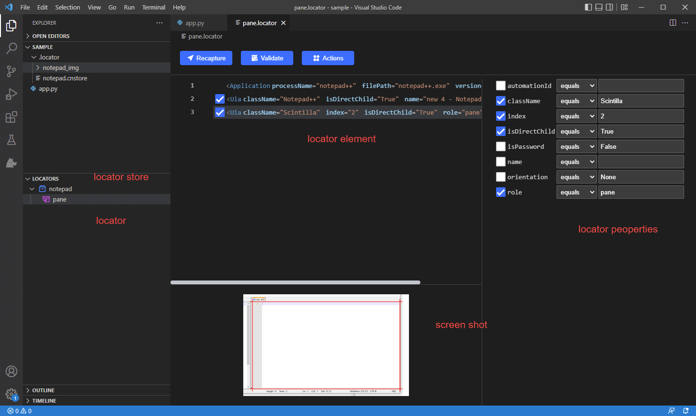

# Clicknium Visual Studio Code Extension<!-- {docsify-ignore-all} -->

  - [Overview](#overview)
  - [Connect To Cloud](#connect-to-cloud)
  - [Extension Installation](#extension-installation)
  - [Create Project](#create-project)
  - [Record UI Locators](#record-ui-locators)
  - [Edit and Validate Locator](#edit-and-validate-locator)
  - [Writing code](#writing-code)
  - [Run/Debug Project](#rundebug-project)
  - [Package Project](#package-project)

## Overview
For python developers using Visual Studio Code, ClickCorp provides clicknium extension that include all automation features.  
You can create python automation project, capture/edit/validate and recapture UI element locators for browsers and various types of desktop applications, run/debug the automation project, package the project as standalone executable file, and provide centeral locator store management on the cloud.  
Besides, Clicknium also improves writing code experience, such as providing Code IntelliSense, error hint, etc.

***Installation​***: Install [Clicknium extension](https://marketplace.visualstudio.com/items?itemName=ClickCorp.clicknium) through Visual Studio Code marketplace or search `clicknium` in Visual Studio Code Extension marketplace.  
***Remarks***: Clicknium extension has dependency on [python extension](https://marketplace.visualstudio.com/items?itemName=ms-python.python), and the extension will be installed automatically. 

## Connect To Cloud
You are required to sign up to ClickCorp after installation, or sign in with a Google or GitHub account. Please go to [Connect To Cloud](./doc/developtools/vscode/connecttocloud.md) for more information.

## Extension Installation
Clicknium extension provides different extensions for automation. For example, Edge Extension helps you execute automation on Microsoft Edge browser.
You can select and install extensions before writing automation code. For more information, please ref to [Automation Extensions](./doc/developtools/extensions/extensions.md)

## Create Project
Open the Command Palette: `Ctrl+Shift+P`
- Input or select: `Clicknium: Create Clicknium Project`
- Select project path
  - You can create one empty folder and select it, and the new project will be created.
  - You can also select one existing folder which will be converted to Clicknium project, and there is no impact on existing source files.
You can go to [Project Management](./doc/developtools/project_management.md) for more information.

## Record UI Locators
In Visual Studio Code, press `CTRL+F10` to invoke Clicknium recorder to capture UI element locators.  
  
The **Capture Technology** indicates which automation technology is currently used to capture UI elements. Default is ***Auto Detect***, which means Clicknium recorder will automatically detect the application type and choose the automation technology accordingly for locators capturing.
You can go to [Clicknium Recorder](./doc/developtools/recorder/recorder.md) for more information.

## Edit and Validate Locator
After recording the locators, you can open and edit the locator in the editor as below.  
 

You can go to [Locator Management](./doc/developtools/vscode/locatormanagement.md) for more information about locator management.  
For more about the locator, please refer to [clicknium locator](./doc/automation/locator.md).  

After editing the locator, you can press the button `Validate` to minimize Visual Studio Code and verify if the target element can be located by the locator. The locator validation result is displayed at the head of each locator layer.  

## Writing code
Clicknium provides plenty of features to help you write automation code more efficiently. For example:  
- Auto Code Complete  
For the locator parameter in `cc.find_element(`, you can press `Ctrl+F10` to invoke Clicknium Recorder to capture a UI element. Once you complete the capturing, the captured element will be automatically filled to code like `cc.find_element(locator.chrome.bing.search_sb_form_q)` in Visual Studio Code.

- IntelliSense  
If you want to choose one locator in the locator store, Clicknium code extension shows the locator store list and the locator list for you to choose.  

Please go to [Code IntelliSense](./doc/developtools/vscode/codeintelliSense.md) for more features.
You can manage the dependencies of the porject in `app.yaml`, for more details, please refer to [Project Management](./doc/developtools/project_management.md)

## Run/Debug Project
There are two ways to debug Clicknium Automation Project:
- Run/Debug using `F5` or `Ctrl+F5`, which is the same way as you debug other python scripts.
- Open the Command Palette: `Ctrl+Shift+P`, input or select: `Clicknium: Run` to run project or `Clicknium: Debug` to debug project.  
It will configure the running/debugging environment. For example, check the python version in clicknium.yaml, restore dependent package list, etc.   
For more details, please refer to [Project Management](./doc/developtools/project_management.md).

## Package Project
When a project is developed, you can distribute the package to the non-developer end users. Clicknium provides features to package the project as one executable file, so the end user can run automation tasks by double clicking it.  
Open the Command Palette: `Ctrl+Shift+P`, Input or select: `Clicknium: Package` to package project.  
For more details, please refer to [Project Package](./doc/developtools/project_package.md).