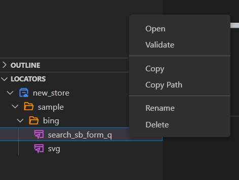
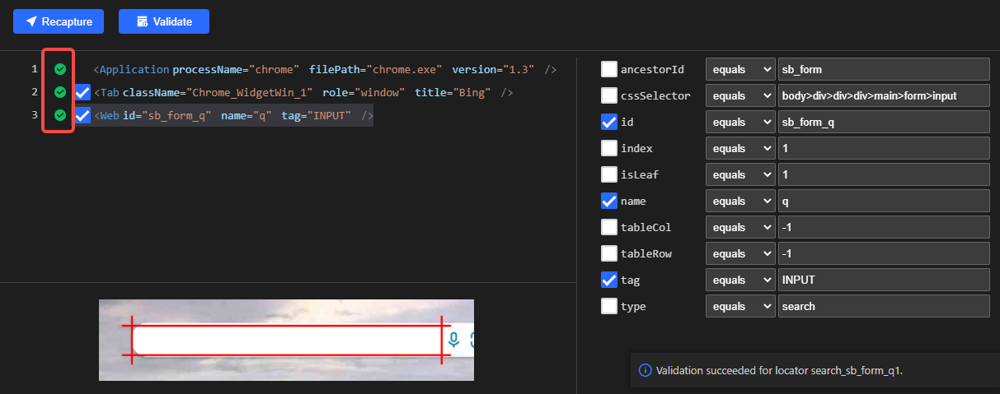
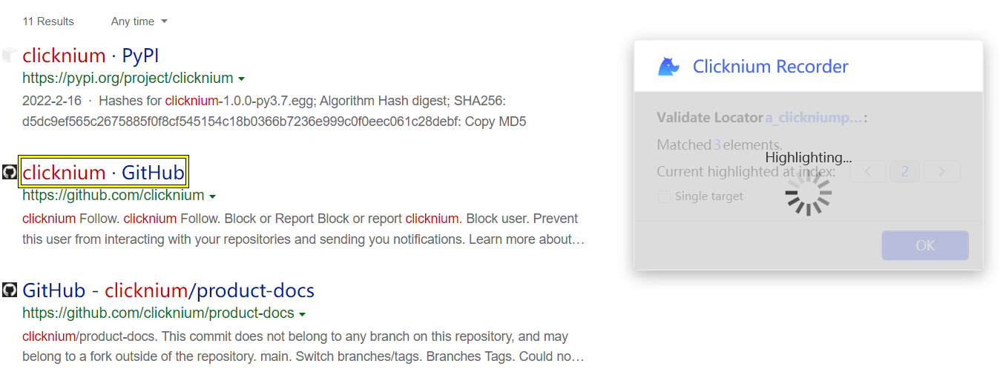
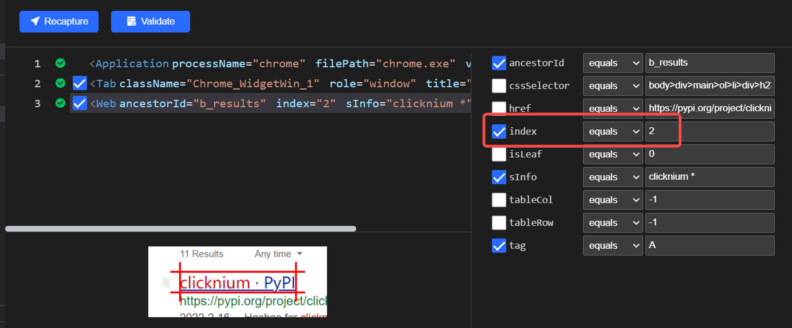

# Locator Management<!-- {docsify-ignore-all} -->

  - [Edit Store](#edit-store)
  - [Edit Folder](#edit-folder)
  - [Edit Locator](#edit-locator)
  - [Recapture](#recapture)
  - [Validate](#validate)

## Edit Store

  
    
1. New Folder: create a new folder under the selected store.  
2. Remove Reference：remove the referenced store in the project.  
3. Rename：rename the referenced store in the project/scripts, notice the referencing code may need to be updated accordingly. 

## Edit Folder

  

1. New Folder: create a new folder under the selected folder.  
2. Rename：rename the folder.  
3. Delete: delete the folder.  

## Edit Locator

  

1. Open: open locator details in the VScode edit window. 
2. Validate: validate the locator.
3. Copy: create a same locator under the same directory.
4. Copy Path: put the path of the locator in clipboard, so users can paste it directly in the Python code.
5. Rename: rename the locator
6. Delete: delete the locator

## Locator Editor
  

The detail page of locator editor is organized with two parts, left and right.
- Left part: displays locator tiers as XML based view  
- Right part：displays the attribute details for the selected XML node on the left part.  

- Checkbox ①: Select the locator tier. The unchecked tier will be ignored when locating the UI element.  
- Checkbox ②：Select the properties for the selected locator tier. This unselected properties will be ignored when locating the UI element.  
- Dropdown ③: There are 4 matching operators, "equals", "contains", "startWith" and "endWith".  
  
- Input item ④：The values of the property  
    Notes：When the matching rule is "equals", the value supports wildcard characters.
    |Wildcard characters| Functions                 |
    |-------|----------|
    |*    | Substitute one or more characters |
    |?    | Substitute a character      |

## Recapture
1. Click the "Recapture" button to open the recorder and record the locator again.
2. Record the corresponding target UI element.
3. When recording succeeds, return to vscode and save the newly recorded element by pressing Ctrl+S.

## Validate
Click "Validate" button.

### Validation succeed
1. The recorder opens the window containing a locator and  marks the corresponding element.  
  

2. Within a few seconds, it automatically returns to the vscode window and marks as correct.  
  

### Validation fail
- If the recorder cannot find the target element, it automatically returns to the vscode window within a few seconds and marks the locator tier that cannot be found.

  
- Notes: The application will not be opened and the corresponding URL will not be entered in the verification. If the error is marked in layer one or layer two , please confirm whether the application and URL are opened.

  

### Multiple windows exist in validation
- If multiple opened Windows contain the locator at the same time, the recorder will provide a pop-up dialog to select Window.

  

- After selecting the one among the matched windows, the corresponding window will be validated in a few seconds and return to vscode.

### Multiple elements are located in validation
- If multiple locators are matched in the window, the recorder will provide a window for selecting the locator index. 
- If you switch the Index, the corresponding locator is highlighted.
  
  

- If you want to update the switched Index in a locator, check "set single target" and click "OK". 
  
  

- After switching back to vscode, the corresponding Index property will be updated to the last Index and checked. 
  
  